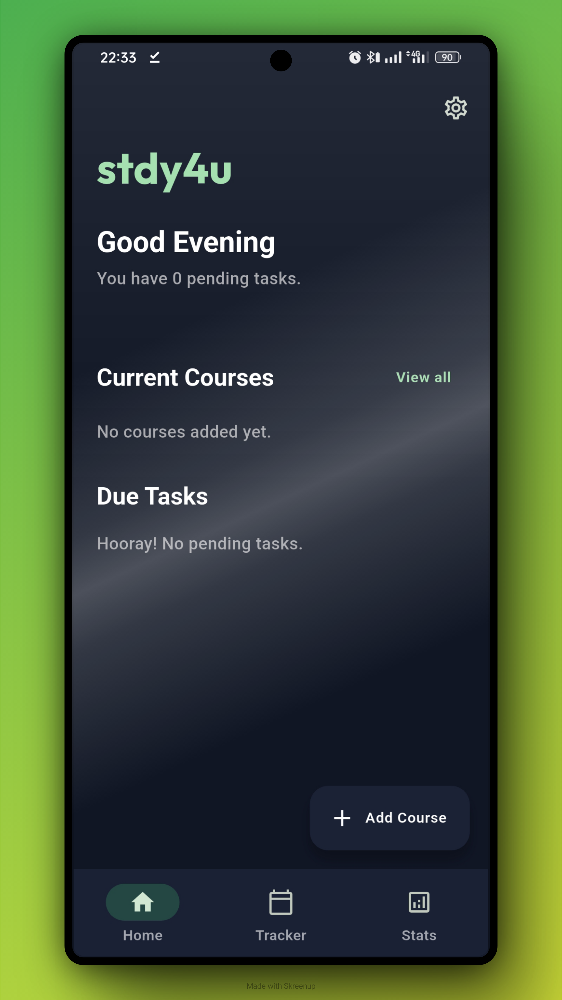
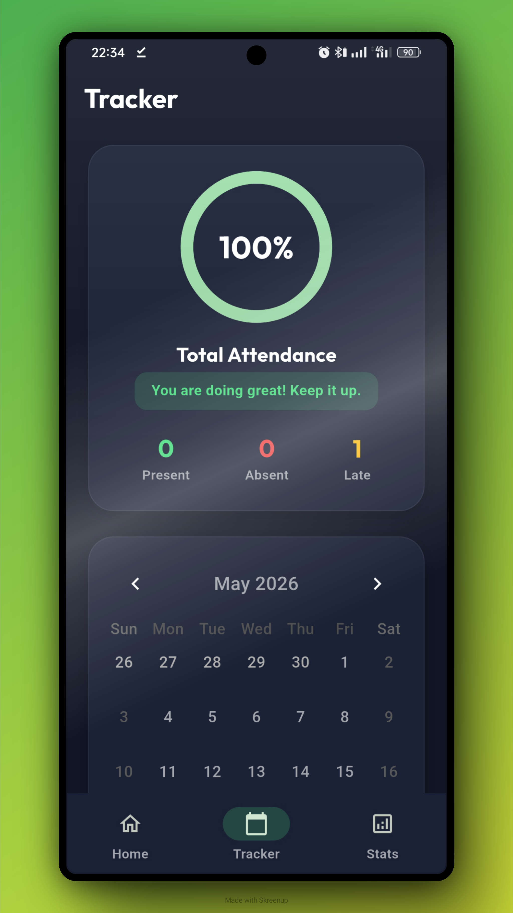
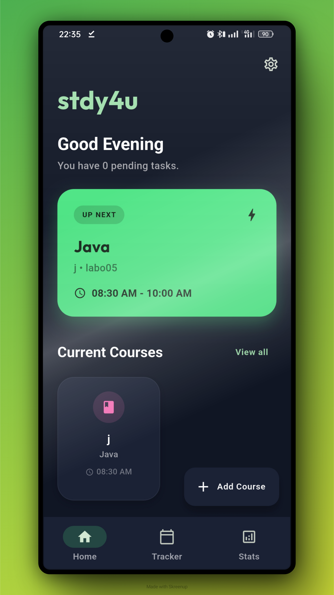
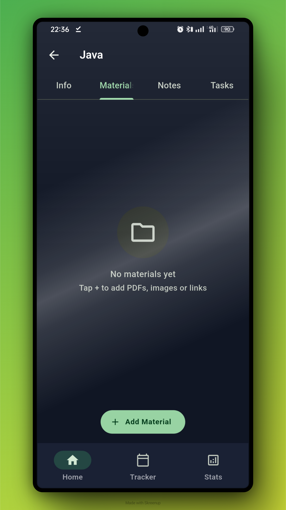
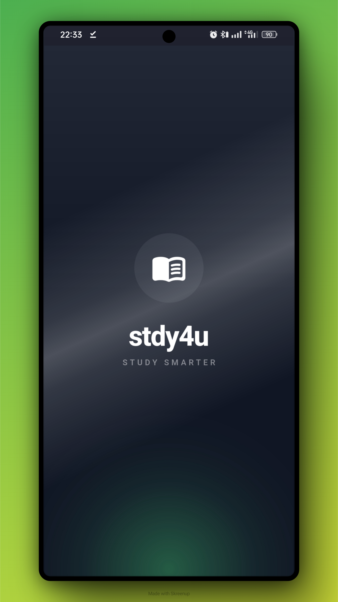

<div align="center">
  <br>
  <h1>📚 stdy4u</h1>
  <h3><em>STUDY SMARTER</em></h3>
  <p><strong>v1.1.2</strong> — Local-first student productivity companion</p>
  <br>
</div>

---

## 📱 Preview

<p align="center">
  
  
  
  
  
</p>

---

## ✨ Features

### 🎓 Course Management
- Add courses with name, code, professor, room, schedule, and color coding
- Track grades, target GPA, and credit hours per course
- Edit or delete courses via long-press context menu
- Visual progress indicators on the home dashboard

### ✅ Tasks & Notes
- Create tasks with due dates and urgency levels (Normal / Urgent)
- Course-specific notes tab
- Check-off completion with animated toggle
- Filter by course on the detail screen

### 📂 Course Materials
- Add materials as **links**, **notes**, or **uploaded files** (PDF, images, docs)
- Stored locally — files are copied to the app's documents directory
- Tap to open files or URLs
- Delete unwanted materials with the delete button

### 📅 Attendance Tracker
- Mark attendance per course: Present / Late / Absent / Excused
- Calendar view with `table_calendar` — tap a day to see all courses
- Automatic attendance rate calculation with configurable threshold warning
- Quick-action chips in the daily schedule

### 📊 Statistics & Analytics
- CGPA calculation with letter grade conversion (A, B, C, D, F)
- Grade distribution bar chart per course
- Per-subject performance overview with progress rings
- Pomodoro focus time analytics — weekly bar chart

### ⏱️ Pomodoro Timer
- Focus sessions with configurable durations (1–60 min)
- Short break (1–30 min) and long break (1–60 min) with auto-rotation
- Session counter and haptic feedback
- Calm music player — pick audio files to play during focus sessions
- Weekly focus analytics dashboard

### 🎨 Theming & Personalization
- Light, Dark, and System Default modes
- 8 accent colors to personalize the UI
- **Floating Navigation Bar** — glassmorphism frosted glass effect
- Haptic feedback toggle
- Material 3 expressive design

### 🔔 Notifications
- Weekly recurring class reminders (15 min before each class)
- Task reminders and session alerts
- Notification history bottom sheet
- Toggle notifications in Settings

### 🚀 Updates
- On-launch GitHub OTA update check
- Download progress dialog with auto-install
- Manual check in Settings → About → Check for Updates

---

## 🛠️ Tech Stack

| Layer | Technology |
|-------|-----------|
| **Framework** | Flutter 3.44 + Dart |
| **State Management** | Riverpod (`flutter_riverpod`) |
| **Navigation** | GoRouter with ShellRoute |
| **Local Storage** | Hive (`hive_flutter`) |
| **Charts** | fl_chart |
| **Calendar** | table_calendar |
| **Animations** | flutter_animate, animate_do |
| **Notifications** | flutter_local_notifications |
| **Audio** | just_audio |
| **File Picker** | file_picker |
| **Code Generation** | build_runner + hive_generator + riverpod_generator |
| **CI/CD** | GitHub Actions (build + release APK) |

---

## 📂 Project Structure

```
lib/
├── core/
│   ├── constants/       # App-wide constants
│   ├── errors/          # Custom exception classes
│   ├── extensions/      # BuildContext helpers
│   ├── services/        # NotificationService, UpdateService
│   └── utils/           # Grade calculator, time utilities
├── data/
│   ├── datasources/     # LocalStorage (Hive init + box access)
│   ├── models/          # AppSettings, ScreenTimeLog (Hive-annotated)
│   └── repositories/    # Repository implementations
├── domain/
│   ├── entities/        # Course, Task, CourseMaterial, AttendanceRecord
│   ├── repositories/    # Abstract repository interfaces
│   └── usecases/        # Business logic: CGPA, attendance, schedule
├── presentation/
│   ├── features/        # Screen widgets grouped by feature
│   │   ├── dashboard/   # Home dashboard with greeting + progress
│   │   ├── home/        # Main screen shell with tabs
│   │   ├── tracker/     # Attendance tracker with calendar
│   │   ├── stats/       # Statistics & CGPA visualization
│   │   ├── settings/    # App settings & about
│   │   ├── splash/      # Animated splash screen
│   │   └── course_detail/ # Course detail & tasks/materials
│   ├── theme/           # AppTheme, DesignTokens, ThemeProvider
│   └── widgets/         # Reusable UI components
└── shared/
    ├── models/          # Hive-annotated shared models
    └── providers/       # Riverpod providers
```

---

## 🚀 Getting Started

### Prerequisites
- Flutter SDK `>=3.6.0 <4.0.0`
- Android Studio / VS Code with Flutter plugins

### Setup

```bash
# Clone the repository
git clone https://github.com/MoHamed-B-M/study4u.git
cd study4u

# Install dependencies
flutter pub get

# Generate Hive adapters & Riverpod providers
dart run build_runner build --delete-conflicting-outputs

# Run in debug mode
flutter run

# Build release APK
flutter build apk --release
```


---

## 📦 Building for Release

```bash
# Increment version in pubspec.yaml, then:
flutter build apk --release --build-number=$YOUR_BUILD_NUMBER

# Or with signing env vars (CI):
flutter build apk --release --build-number=$CI_PIPELINE_ID
```

> The repository includes a GitHub Actions workflow (`.github/workflows/build_apk.yml`) that builds a release APK automatically on every push.

---

## 📄 Changelog

See [CHANGELOG.md](CHANGELOG.md) for a full history of changes.

---

## 🏫 School Project

This app was developed as a school project for **Madame Basma**.

---

## 📝 License

Private project.
