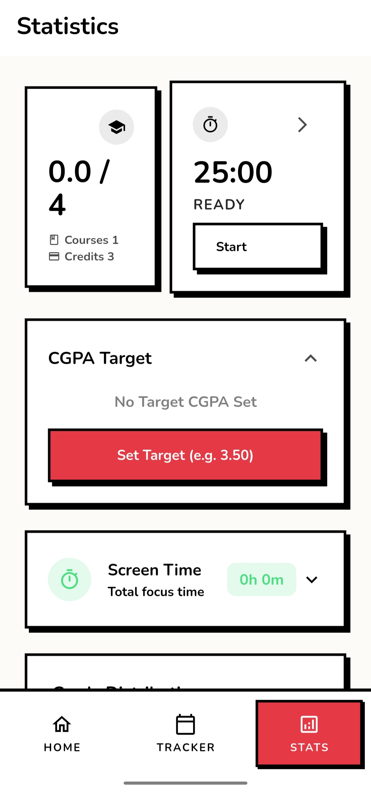
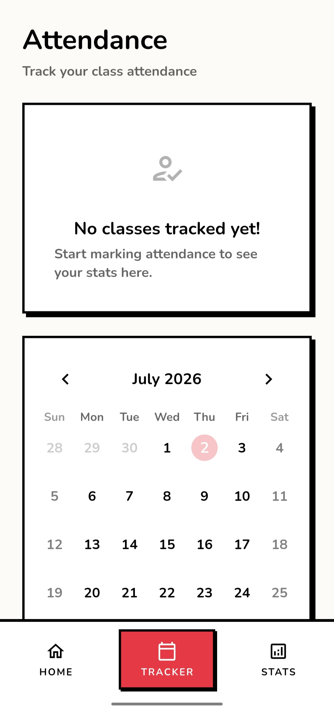
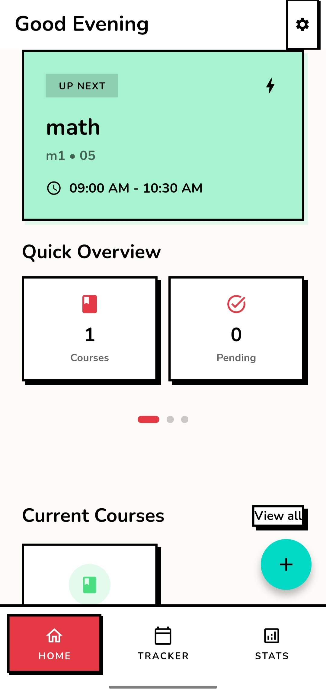

<div align="center">

# stdy4u

**Study smarter** — a local-first student productivity companion built with Flutter.

[](pubspec.yaml)
[](https://flutter.dev)
[](https://dart.dev)
[](https://github.com/MoHamed-B-M/study4u/actions/workflows/build.yaml)
[](#getting-started)
[](https://github.com/MoHamed-B-M/study4u/releases)
[](LICENSE)
[](https://visitorbadge.io)

</div>

---

## Overview

stdy4u helps students manage courses, attendance, tasks, grades, and focus time in one offline-first app. All data is stored locally on the device — no account required. The interface uses a distinctive comic-print design system with high-contrast ink styling.

## Features

### Course Management
- Add courses with name, code, professor, room, schedule, and color coding
- Track grades, target GPA, and credit hours per course; target CGPA persists across sessions
- Edit or delete courses through a long-press context menu
- Visual progress indicators on the home dashboard

### Tasks & Notes
- Create tasks with due dates and urgency levels (Normal / Urgent)
- Course-specific notes tab
- Animated completion toggle
- Filter tasks by course on the detail screen

### Course Materials
- Attach materials as links, notes, or uploaded files (PDF, images, docs)
- Files are copied to the app documents directory and stay available offline
- Open files or URLs with a tap

### Attendance Tracker
- Mark attendance per course: Present / Late / Absent / Excused
- Monthly calendar view; tap any day to see all scheduled courses
- Automatic attendance rate calculation with configurable threshold warnings
- Quick-action chips in the daily schedule

### Pomodoro Timer
- Focus sessions with configurable durations (1-60 min)
- Short break (1-30 min) and long break (1-60 min) with automatic rotation
- Session counter and haptic feedback
- Optional music playback during focus sessions
- Weekly focus analytics dashboard

### Screen Time Insights
- Reads device usage statistics through a native `UsageStatsManager` bridge (`app_usage`)
- Per-app daily usage entries stored locally in Hive
- Expandable screen time panel on the Stats screen

### Statistics & Analytics
- CGPA calculation with letter grade conversion (A-F)
- Grade distribution chart per course
- Per-subject performance overview with progress rings
- Weekly Pomodoro focus time chart

### Comic-Print Design System
- Light, dark, and system default modes
- Neo-brutalist manga aesthetic: flat surfaces, sharp 2.5 px ink-black borders, hard offset shadows, zero border radius
- Signature Ink Red accent (`#E63946`) on aged paper and dark pulp backgrounds
- Custom navigation bar with flat geometry, thick top border, all-caps labels
- Haptic feedback and press-sound toggles

### Notifications & Alarms
- Weekly recurring class reminders (15 minutes before each class)
- Task reminders and session alerts
- Exact alarms via `SCHEDULE_EXACT_ALARM` and a native alarm receiver
- Notifications can be toggled in Settings

### In-App Updates
- On-launch update check against GitHub releases with markdown release notes
- Download with pause, resume, and cancel support; progress survives interruptions
- Manual check available under Settings > About > Check for Updates

## Preview

| Dashboard | Attendance Tracker | Statistics |
|:---:|:---:|:---:|
|  |  |  |

## Commit Activity

Development history of the main branch, generated from `git log`:

```
 62 COMMITS | JUN 25 - JUL 07, 2026
 ────────────────────────────────────────
 Jun 25 │████░░░░░░░░░░░░░░░░░░░░│   3
 Jun 26 │███░░░░░░░░░░░░░░░░░░░░░│   2
 Jun 27 │███████████░░░░░░░░░░░░░│   8
 Jun 28 │██████░░░░░░░░░░░░░░░░░░│   4
 Jun 29 │███████░░░░░░░░░░░░░░░░░│   5
 Jun 30 │███░░░░░░░░░░░░░░░░░░░░░│   2
 Jul 01 │██████████████████░░░░░░│  13
 Jul 02 │███░░░░░░░░░░░░░░░░░░░░░│   2
 Jul 03 │░░░░░░░░░░░░░░░░░░░░░░░░│   0
 Jul 04 │░░░░░░░░░░░░░░░░░░░░░░░░│   0
 Jul 05 │░░░░░░░░░░░░░░░░░░░░░░░░│   0
 Jul 06 │████████████████████████│  17
 Jul 07 │████████░░░░░░░░░░░░░░░░│   6
 ────────────────────────────────────────
 DAILY COMMIT COUNT | 10 OF 13 DAYS ACTIVE
```

## Getting Started

### Prerequisites

- Flutter SDK with Dart `>=3.6.0 <4.0.0`
- Android Studio or VS Code with the Flutter plugin
- For iOS builds: Xcode 15+ and CocoaPods

### Installation

```bash
git clone https://github.com/MoHamed-B-M/study4u.git
cd study4u
flutter pub get
```

Verify your toolchain:

```bash
flutter doctor
```

Run in debug mode:

```bash
flutter run
```

### Code Generation

Models annotated for Hive use code-generated adapters. Regenerate after any model change:

```bash
dart run build_runner build --delete-conflicting-outputs
```

### Build and Verify

```bash
# Static analysis - must report zero errors before committing
flutter analyze --no-pub

# Release build used by CI
flutter build apk --release --split-per-abi
```

## User Guide

<details>
<summary><strong>Expand the user guide</strong></summary>

### First launch
An animated splash screen leads into a short onboarding carousel. Tap START to begin. The app works fully offline; no sign-up is needed.

### Adding your first course
On the Home tab, press the + button to open the Add Course sheet. Fill in name, code, professor, room, and schedule, pick a color, and set target grade plus credits. Long-press any course card to edit or delete it.

### Daily dashboard
The Home screen shows a personalized greeting, an Up Next card with your next class and countdown, expandable motivational quote cards, course progress rings for attendance rate, and pending tasks with quick actions.

### Marking attendance
Open the Tracker tab, tap any date, then mark each course as Present, Late, Absent, or Excused. The tracker computes your attendance percentage and warns you when it drops below the configured threshold.

### Using the Pomodoro timer
Open the Pomodoro modal from the Stats screen. Tap the gear icon to adjust focus and break durations, then press Play. Weekly focus statistics appear on the Stats screen.

### Grades and screen time
The Stats screen shows overall CGPA with a per-course breakdown, weekly Pomodoro focus charts, and an expandable device screen time panel.

### Materials, tasks, and notes
Tap any course card to open its detail screen with three tabs: Materials, Tasks, and Notes.

### Settings
Switch between light, dark, and system theme; toggle haptic feedback, notifications, and press sounds.

</details>

## Architecture

The project follows Clean Architecture with three layers wired together by Riverpod:

```
presentation/   Screens, providers, theme
domain/         Entities, abstract repositories,
                use cases (CGPA, attendance analytics,
                schedule optimizer)
data/           Hive datasources, models,
                repository implementations,
                platform bridges (MethodChannels)
```

### State management pattern

- `dataRefreshProvider` (`StateProvider<int>`) acts as a shared refresh counter.
- List providers such as `courseListProvider`, `taskListProvider`, and `attendanceRecordsProvider` watch it.
- Mutations increment the counter to trigger list re-evaluation.
- Settings use `StateNotifierProvider<SettingsNotifier, AppSettings>` backed by Hive.

### Navigation

GoRouter with a `ShellRoute` hosts the three tab routes (`/`, `/tracker`, `/stats`) inside an `IndexedStack`. Standalone routes (`/settings`, `/course/:id`) use a custom slide transition.

## Tech Stack

| Layer | Technology |
|-------|-----------|
| Framework | Flutter (Dart >= 3.6.0) |
| State management | Riverpod (`flutter_riverpod`) |
| Navigation | GoRouter with ShellRoute |
| Local storage | Hive + hive_flutter (generated adapters) |
| Calendar UI | table_calendar |
| Icons / SVG | solar_icons, flutter_svg |
| Notifications | flutter_local_notifications + timezone |
| Audio | just_audio |
| Files | file_picker, open_filex |
| Usage stats | app_usage (native bridge) |
| Markdown | flutter_markdown |
| Code generation | build_runner, hive_generator, riverpod_generator |
| CI/CD | GitHub Actions (build + release APK) |

Charts are hand-painted with `CustomPaint`; no chart library dependency.

## Project Structure

```
lib/
├── core/
│   ├── animation/       # Page-scale transition helpers
│   ├── constants/       # App-wide constants
│   ├── errors/          # Custom exceptions
│   ├── extensions/      # BuildContext helpers
│   ├── services/        # NotificationService, UpdateService, SoundService
│   └── utils/           # Grade calculator, time utilities
├── data/
│   ├── datasources/     # LocalStorage (Hive init and box access)
│   ├── models/          # Hive-annotated models (AppSettings, ScreenTimeLog)
│   ├── platform/        # MethodChannel bridges (alarm, calendar, screen time, settings)
│   └── repositories/    # Repository implementations
├── domain/
│   ├── entities/        # Course, Task, CourseMaterial, AttendanceRecord, PomodoroSession
│   ├── repositories/    # Abstract repository interfaces
│   └── usecases/        # CGPA calculator, attendance analytics, schedule optimizer
├── presentation/
│   ├── features/        # Screens grouped by feature
│   │   ├── home/            # Main shell and tabs
│   │   ├── dashboard/       # Home dashboard (greeting, Up Next, progress rings)
│   │   ├── tracker/         # Attendance tracker calendar
│   │   ├── statistics/      # Stats screen wrapper
│   │   ├── stats/           # Statistics, CGPA, Pomodoro, screen-time views
│   │   ├── settings/        # App settings and about
│   │   ├── splash/          # Animated splash screen
│   │   ├── feature_preview/ # Onboarding carousel
│   │   └── course_detail/   # Course detail: materials, tasks, notes
│   ├── providers/       # Feature-level providers (pomodoro, alarms, calendar)
│   ├── theme/           # Theme provider, SettingsNotifier
│   └── widgets/         # UpdateDialog, snackbars
├── shared/              # Cross-feature models, providers, widgets, theme
├── theme/               # ComicTheme design system
└── widgets/             # MangaNavBar, ComicCard, shared atoms

android/app/src/main/kotlin/com/example/study4u/
├── MainActivity.kt
├── AlarmReceiver.kt     # Exact-alarm broadcast receiver
├── AlarmPlugin.kt       # MethodChannel: alarm scheduling
├── CalendarPlugin.kt    # MethodChannel: calendar read/write
├── ScreenTimePlugin.kt  # MethodChannel: UsageStatsManager queries
└── SettingsPlugin.kt    # MethodChannel: battery-optimization prompts
```

## Android Permissions

| Permission | Purpose |
|------------|---------|
| `PACKAGE_USAGE_STATS` | Read device screen-time statistics |
| `READ_CALENDAR` / `WRITE_CALENDAR` | Sync courses with the device calendar |
| `POST_NOTIFICATIONS` | Class and task reminders, update notices |
| `SCHEDULE_EXACT_ALARM` | Exact class-reminder alarms |
| `RECEIVE_BOOT_COMPLETED` | Re-register alarms after reboot |
| `FOREGROUND_SERVICE` | Background alarm and service support |

Battery-optimization exemption is requested at runtime so reminders fire reliably.

## Building for Release

```bash
# Increment version in pubspec.yaml first
flutter build apk --release --split-per-abi --build-number=$YOUR_BUILD_NUMBER
```

Pushing a tag matching `v*.*.*` triggers the GitHub Actions release workflow, which builds signed APKs and attaches them to a GitHub Release.

## Roadmap

- Home-screen widgets (Android AppWidget + iOS WidgetKit) showing study statistics with deep links into the app
- Quick actions / app shortcuts: start focus timer, open flashcards, create a study session
- Flashcards feature

See [CHANGELOG.md](CHANGELOG.md) for shipped changes.

## Acknowledgments

Developed as a school project for Madame Basma.

## License

Released under the [GNU Affero General Public License v3.0](LICENSE).

AGPL-3.0 is a strong copyleft license: modified versions made available over a network must offer their corresponding source code under the same license.
